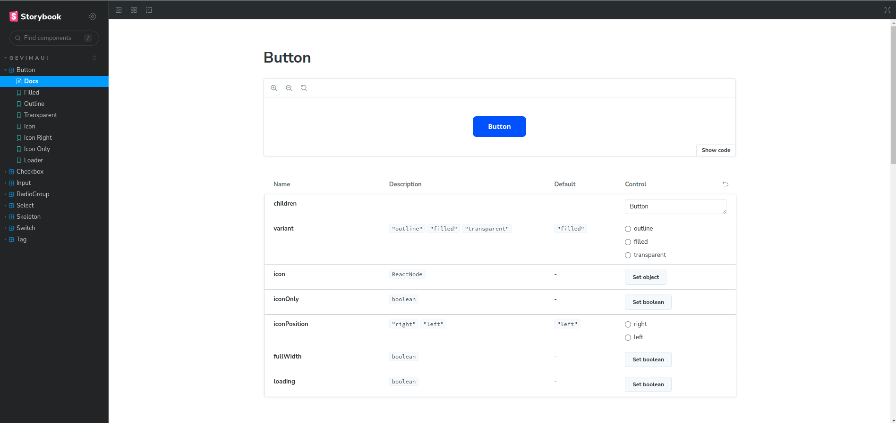

<h1 align="center">GevimaUI</h1>

<div align="center">

A modern library for reactJS components

[![NPM version][npm-image]][npm-url] [![NPM downloads][download-image]][download-url]

[npm-image]: https://img.shields.io/npm/v/gevima-ui?style=for-the-badge
[npm-url]: https://www.npmjs.com/package/gevima-ui
[download-image]: https://img.shields.io/npm/dm/gevima-ui.svg?style=for-the-badge
[download-url]: https://npmjs.org/package/gevima-ui

</div>

## 📚 Homepage

- Visit [here](https://gevima-ui.vercel.app/)



## ✨ Features

- 📦 An uncommonly high quality set of React components.
- 🛡 Written entirely in TypeScript with predictable static types.
- ⚙️ A full suite of design resources and tools to facilitate development.

## 📦 Install

```bash
npm install gevima-ui
```

```bash
yarn add gevima-ui
```

## 🔨 Usage

```tsx
import React, { FC } from 'react';
import { Button, Input } from 'gevima-ui';

const App: FC = () => (
  <>
    <Input label='Label' />
    <Button>Button</Button>
  </>
);

export default App;
```

## ⌨️ Development

### Node version

First of all let's use version 21 of node so we don't have compatibility problems, for this we can use [nvm](https://github.com/nvm-sh/nvm#installing-and-updating) just run in the repository folder the command:

```bash
$ nvm use
```

This command will look for the .nvmrc file and will find the version with which the project was created.

---

## Prerequisites 🛠️

Before you begin, ensure you have met the following requirements:

Make sure you have:

- Nodejs
- npm or yarn
- git

## Let's Contribute 👍

- Step 1 - Fork this repository.
- Step 2 - Clone the repository to your local machine.
- Step 3 - Resolve the bugs, mentions provided in the Issues section of the repository. Also add a description of what changes you have done.
- Step 4 - Add the changes to your repository.
- Step 5 - Create a PULL Request. And that's all.

## What you can contribute in this repo? 👊

- You can add your own competitive programming solutions.
- There are various topics like Functionality, Modal aspect of gevima-ui etc. You can contribute in them
- You can contribute some Learning Resources in the READme.md File.
- You can modify previous solutions if you feel like your solution has better Time or Space complexity.

## Contributors 💡

<table align="center">
  <tr>
   <td align="center"><a href="https://github.com/geamdev"><br /><sub><b>Geampiere Jaramillo</b></sub></a><br />
    <a href="https://github.com/geamdev/gevima-ui/commits/main/?author=geamdev" title="Code">💻</a></td>
  </tr>
</table>

## Keywords 🤌

TypeScript javascript Library ReactJS Components Microsoft compiler language UI React-ui framework
frontend Design library-ui
